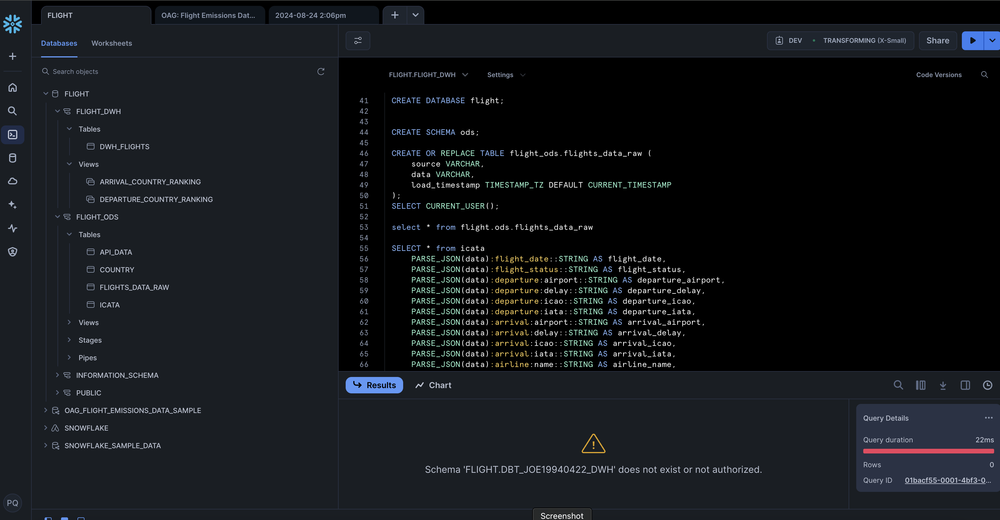
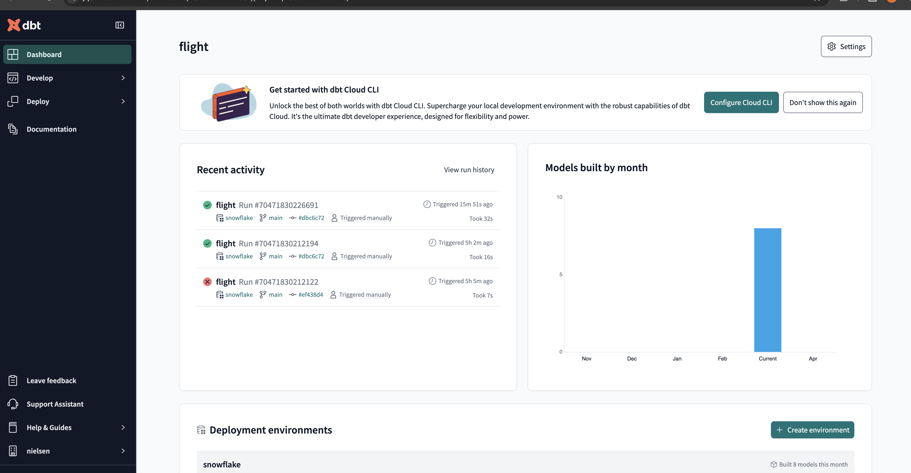
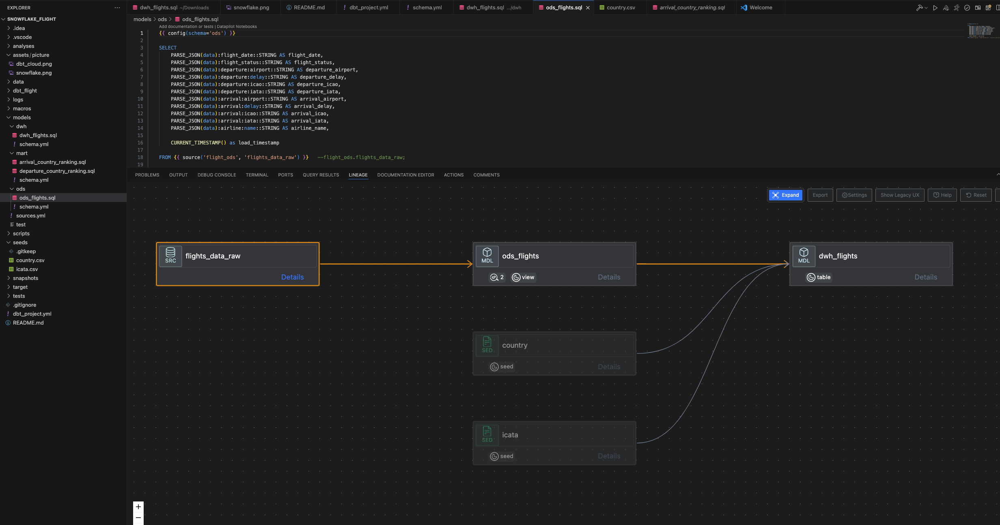

# ODS in Snowflake for AviationStack Data

## Project Overview

This project implements an Operational Data Store (ODS) in Snowflake to ingest, store, and manage JSON data from the AviationStack API. The ODS is designed to handle real-time or near-real-time data ingestion, providing a centralized repository for operational data that can be used for reporting, analysis, and further processing.

## Features

- **Data Ingestion**: Automated extraction of flight data from the AviationStack API.
- **JSON Storage**: Raw JSON data is stored in a Snowflake `VARIANT` column, ensuring that the structure is preserved and can be queried easily.
- **Operational Data Store (ODS)**: Provides a staging area for raw data, enabling further transformations and integration into data warehouses or other systems.
- **Audit and Traceability**: Each record in the ODS is tagged with a `load_timestamp` and `source` to facilitate tracking and auditing of data lineage.
- **Scalability**: Designed to handle data from multiple APIs and data sources, ensuring scalability as the data volume grows.

## Project Structure

- **ods_schema.sql**: SQL script to create the ODS schema and tables in Snowflake.
- **data_ingestion.py**: Python script to extract JSON data from the AviationStack API and load it into the Snowflake ODS.
- **transformations.sql**: SQL scripts for transforming raw JSON data into structured formats for downstream use.
- **README.md**: Project documentation and setup instructions.

## Getting Started

### Prerequisites

- **Snowflake Account**: A Snowflake account with the necessary privileges to create schemas, tables, and load data.
<p align="center">
  <a href="https://app.snowflake.com/"></a>
</p>
- **Python 3.x**: Python environment with the following packages installed:
  - `requests`
  - `snowflake-connector-python`

### Setup

1. **create Snowflake Account**:

2. **Create ODS Schema in Snowflake**:
   Run the SQL script to set up the ODS schema and tables.
   ```sql
   -- Connect to Snowflake and execute
   USE DATABASE your_database;
   SOURCE ods_schema.sql;
   ```

3. **Configure API Access**:
   Update the `data_ingestion.py` script with your AviationStack API key.
   ```python
   api_url = 'https://api.aviationstack.com/v1/flights'
   params = {
       'access_key': '****',  
       'flight_status': 'active',
       'limit': 100
   }
   ```

4. **Run Data Ingestion**:
   Execute the Python script to start ingesting data into the ODS.
   ```bash
   python data_ingestion.py
   ```

5. **Query Data**:
   Use Snowflake to query and analyze the ingested data.
   ```sql
   SELECT * FROM ods.flights_data_raw;
   ```
6. **DBT cloud**: 
   Use dbt labs schdule a job every day
   <p align="center">
   <a href="https://app.snowflake.com/"></a>
   </p>

7. *Data Lineage*
   <p align="center">
   <a href="https://app.snowflake.com/"></a>
   </p>
### Usage

- **Real-Time Data Ingestion**: The Python script can be scheduled to run periodically using cron jobs, Airflow, or any other scheduler to continuously ingest new data from the API.
- **Data Transformations**: Use the `transformations.sql` script to transform and prepare the data for downstream analytics or integration.

### Contributing

Contributions are welcome! Please submit a pull request or open an issue to discuss any changes or improvements.

### License

This project is licensed under the MIT License - see the [LICENSE](LICENSE) file for details.

### Contact

For questions or feedback, please contact www.pengfeiqiao.com

---

This template provides a clear and structured overview of your project, including setup instructions, usage details, and contributions guidelines. Feel free to customize it further to suit your specific needs.
